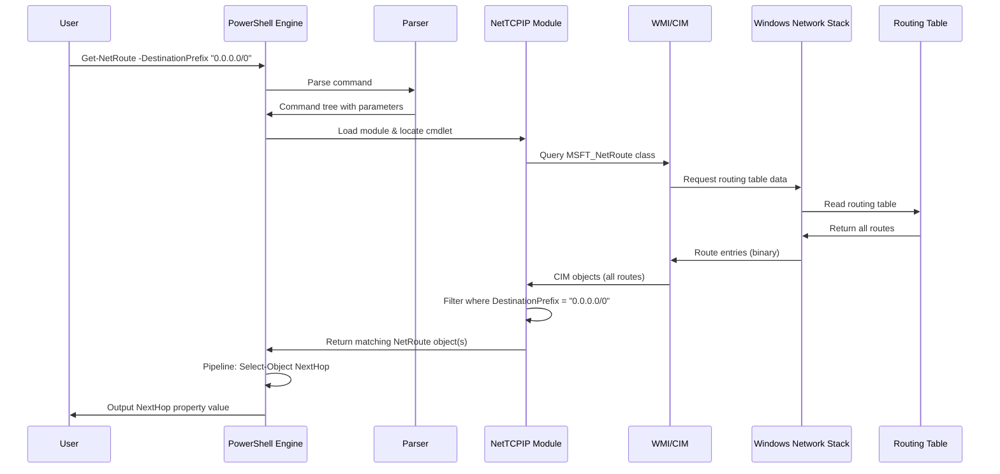

Default Route

```mermaid
	sequenceDiagram
    participant User
    participant PS as PowerShell Engine
    participant Parser
    participant NetTCPIP as NetTCPIP Module
    participant WMI as WMI/CIM
    participant Kernel as Windows Network Stack
    participant RT as Routing Table

    User->>PS: Get-NetRoute -DestinationPrefix "0.0.0.0/0"
    PS->>Parser: Parse command
    Parser->>PS: Command tree with parameters
    PS->>NetTCPIP: Load module & locate cmdlet
    NetTCPIP->>WMI: Query MSFT_NetRoute class
    WMI->>Kernel: Request routing table data
    Kernel->>RT: Read routing table
    RT->>Kernel: Return all routes
    Kernel->>WMI: Route entries (binary)
    WMI->>NetTCPIP: CIM objects (all routes)
    NetTCPIP->>NetTCPIP: Filter where DestinationPrefix = "0.0.0.0/0"
    NetTCPIP->>PS: Return matching NetRoute object(s)
    PS->>PS: Pipeline: Select-Object NextHop
    PS->>User: Output NextHop property value
```

